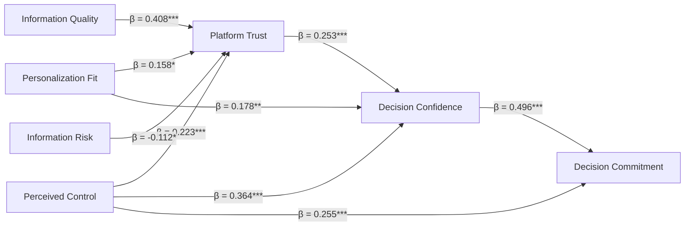
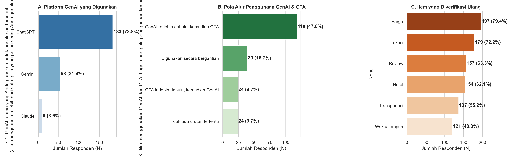
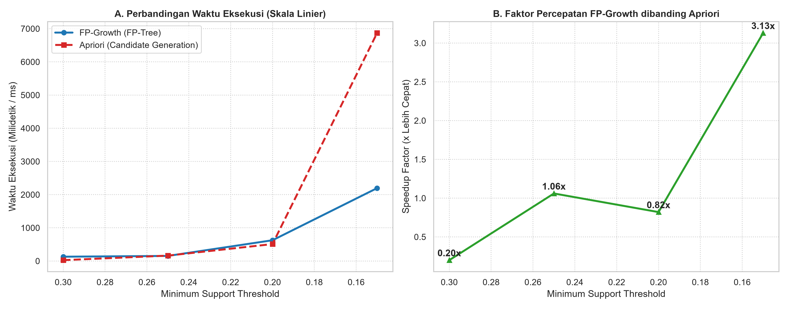
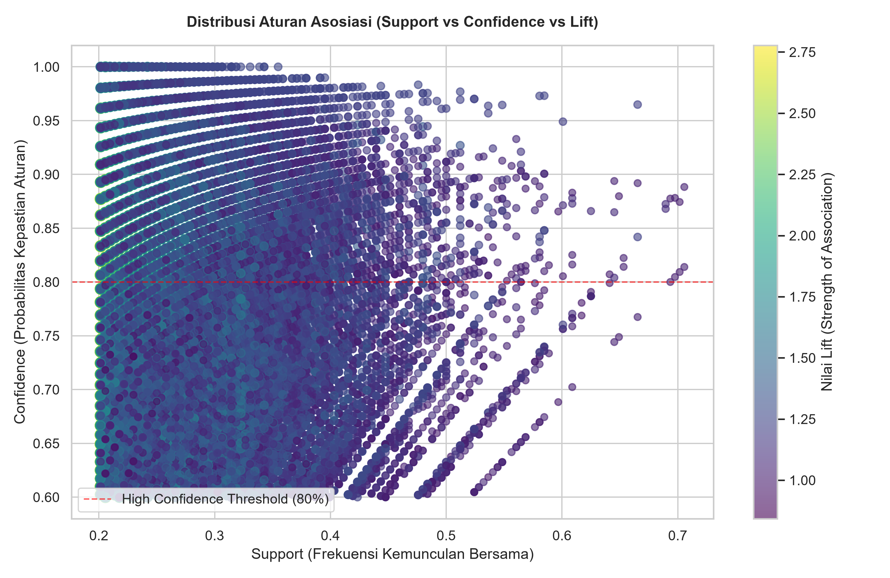
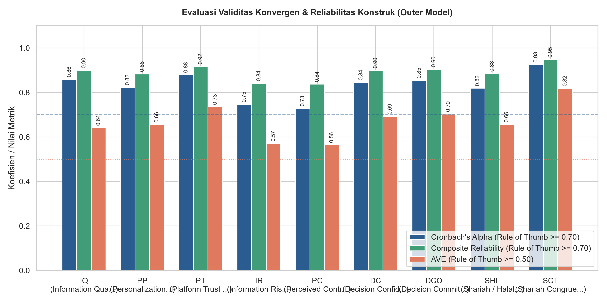

# Mining Human–AI Behavioral Interactions in Tourism Decision-Making: A Comparative FP-Growth and Apriori Association Rule Analysis of Generative AI and Online Travel Agency Co-Usage

[]()
[](https://www.python.org/)
[](https://opensource.org/licenses/MIT)
[](https://www.polban.ac.id/)

Official repository for the research paper:
> **"Mining Human AI Behavioral Interactions in Tourism Decision-Making: A Comparative FP-Growth and Apriori Association Rule Analysis of Generative AI and Online Travel Agency Co-Usage"**  
> *Tomy Andrianto, Ardhian Ekawijana\*, Susanto Eko, Nicole Bian Hao Ledesma, Minh Cong Nguyen, Krisna Yudha Bakhti, Mochamad Edman Syarief*  
> **Corresponding Author:** Ardhian Ekawijana (`ardhian.ekawijana@polban.ac.id`)  
> *Politeknik Negeri Bandung (Indonesia), Davao Tourism Association (Philippines), Duy Tan University (Vietnam)*

---

## 📌 Abstract

Generative artificial intelligence (GenAI) assistants such as ChatGPT and Gemini are increasingly used alongside online travel agencies (OTAs) during trip planning, yet the discrete behavioral combinations that link GenAI-supported ideation to OTA-based verification remain poorly understood. This study applies association rule mining (ARM) to behavioral data from a scenario-based international travel-planning task (Shanghai–Hangzhou, five days and four nights, budget CNY 8,000) completed by $N = 248$ screened participants. 

Multi-select responses on GenAI tasks, OTA tasks, verified information items, platform-usage sequence, and a median-split decision-commitment outcome were encoded into a $248 \times 34$ binary transaction matrix. FP-Growth and Apriori were benchmarked across four minimum-support thresholds, and target-constrained rules were mined at $\text{support} \ge 0.20$ and $\text{confidence} \ge 0.60$, with every rule tested using a one-sided Fisher exact test and Benjamini–Hochberg false discovery rate (FDR) correction.

```
                    ┌─────────────────────────┐
                    │   GenAI Ideation Layer  │
                    │ (ChatGPT, Gemini, Claude)│
                    └────────────┬────────────┘
                                 │
                   Divergent Planning & Itinerary
                                 │
                                 ▼
                    ┌─────────────────────────┐
                    │  Cross-Verification     │ ◄── 93.15% Travelers Cross-Check
                    │  (Transit Time, Hours)  │     (Conf: 89.7%, Lift: 1.838)
                    └────────────┬────────────┘
                                 │
                    Convergent Validation & Fares
                                 │
                                 ▼
                    ┌─────────────────────────┐
                    │    OTA Validation Layer │
                    │ (Trip.com, Agoda, Maps) │
                    └─────────────────────────┘
```

---

## 🎯 Research Questions (RQs) & Key Findings

| Research Question | Focus | Empirical Finding |
|---|---|---|
| **RQ1: Algorithmic Benchmark** | How do FP-Growth and Apriori compare in execution time on a small, dense behavioral transaction dataset across minimum-support thresholds? | **Crossover scaling behavior:** Apriori is faster at high support ($s = 0.30$, speed ratio $0.20$), but FP-Growth is **$3.13\times$ faster** at low support ($s = 0.15$) when the frequent itemset space expands to $155,199$ itemsets. |
| **RQ2: Verification Chains** | Which cross-platform association rules characterize verification behavior when travelers combine GenAI assistants and OTAs? | **Targeted uncertainty auditing:** Delegating logistics to GenAI strongly triggers verification of **travel time** ($\text{Conf } 0.897, \text{Lift } 1.838$) and **attraction opening hours** ($\text{Conf } 0.893, \text{Lift } 1.815$), and GenAI accuracy ($\text{Conf } 0.943, \text{Lift } 1.746$). |
| **RQ3: Decision Commitment** | Do behavioral item combinations predict high decision commitment, and how does this compare with the psychological pathway? | **Psychological mediation over discrete rules:** Rule-based prediction of commitment was weak ($\text{Lift} \le 1.121$, not significant). Path analysis revealed commitment is driven by **Decision Confidence ($\beta = 0.496$)** and **Perceived Control ($\beta = 0.255$)** ($R^2 = 0.535$). |

---

## 🔬 Dataset & Preprocessing Pipeline

Raw survey responses ($N = 318$) were transformed into an anonymized transaction matrix in six reproducible steps:

1. **Screening Filtering:** Filtered by inclusion criteria (Age $\ge 18$, international trip planned within past 12 months, GenAI used) $\rightarrow$ **$N = 248$ valid participants**.
2. **Parsing and Normalization:** Comma-separated multi-select responses split, trimmed, case-folded, and mapped to canonical bilingual tokens.
3. **Namespace Prefixing:** Partitioned into 6 distinct domain namespaces:
   - `GenAI:` (Tasks performed with GenAI — e.g., `Inspirasi_Ide`, `Susun_Itinerary`, `Estimasi_Budget`)
   - `GenAI_Tool:` (Primary GenAI platform — `ChatGPT`, `Gemini`, `Claude`)
   - `OTA:` (Tasks performed on OTA — `Cek_Harga`, `Cek_Review`, `Banding_Hotel`, `Cek_Ketersediaan`)
   - `Verify:` (Items cross-checked — `Harga`, `Lokasi`, `Waktu_Tempuh`, `Jam_Buka_Atraksi`, `Akurasi_GenAI`)
   - `Pola:` (Usage sequence — `GenAI_Lalu_OTA`, `Simultan_Bergantian`, `OTA_Lalu_GenAI`)
   - `Outcome:` (Median-split Decision Commitment — `High_Commitment`, `Low_Commitment`)
4. **Outcome Discretization:** Split DCO composite score at sample median ($4.75$) $\rightarrow 63.7\%$ high commitment.
5. **Basket Construction:** Compiled unique items per respondent $\rightarrow 248$ transactions over **34 distinct behavioral items**.
6. **One-Hot Encoding:** Binary Boolean Matrix $\mathbf{X} \in \{0, 1\}^{248 \times 34}$.

---

## 📊 Summary of Empirical Results

### 1. Algorithmic Benchmarking (Table 5 in Paper)
*Wall-clock execution time for frequent-itemset extraction under Python 3.12 (`mlxtend`):*

| Minimum Support ($s$) | Frequent Itemsets | FP-Growth (ms) | Apriori (ms) | Speed Ratio (Apriori / FP-Growth) |
|:---:|:---:|:---:|:---:|:---:|
| **0.30** | 3,238 | 129.18 | 25.37 | **0.20** |
| **0.25** | 9,989 | 152.78 | 162.13 | **1.06** |
| **0.20** | 34,514 | 625.08 | 509.63 | **0.82** |
| **0.15** | **155,199** | **2,195.49** | **6,870.53** | **3.13x** |

### 2. Representative Association Rules (Table 7 in Paper)
*Target-constrained rules mined at $s \ge 0.20, c \ge 0.60$ with Benjamini–Hochberg FDR control ($q < 0.05$):*

| ID | Antecedent ($X$) | Consequent ($Y$) | Supp. | Conf. | Lift | Conv. | $p$-value |
|:---:|:---|:---|:---:|:---:|:---:|:---:|:---:|
| **R1** | `[GenAI:Info_Destinasi, GenAI:Inspirasi_Ide, OTA:Banding_Hotel, OTA:Cek_Review, Verify:Lokasi, Verify:Transportasi]` | `[Verify:Waktu_Tempuh]` | 0.210 | **0.897** | **1.838** | 4.950 | $< 0.001$ |
| **R2** | `[GenAI:Info_Transportasi, OTA:Cek_Review, Verify:Transportasi]` | `[Verify:Waktu_Tempuh]` | 0.222 | **0.833** | **1.708** | 3.073 | $< 0.001$ |
| **R3** | `[GenAI:Pilih_Atraksi, Verify:Hotel, Verify:Ketersediaan, Verify:Lokasi]` | `[Verify:Jam_Buka_Atraksi]` | 0.202 | **0.893** | **1.815** | 4.742 | $< 0.001$ |
| **R4** | `[GenAI:Pilih_Atraksi, Verify:Transportasi, Verify:Waktu_Tempuh]` | `[Verify:Jam_Buka_Atraksi]` | 0.226 | **0.848** | **1.725** | 3.353 | $< 0.001$ |
| **R5** | `[GenAI:Estimasi_Budget, GenAI:Pilih_Atraksi, GenAI:Susun_Itinerary, OTA:Banding_Hotel, Verify:Lokasi, Verify:Review_Publik]` | `[Verify:Akurasi_GenAI]` | 0.202 | **0.943** | **1.746** | 8.121 | $< 0.001$ |
| **R6** | `[GenAI:Bandingkan_Alternatif, OTA:Banding_Hotel, Verify:Ketersediaan]` | `[Verify:Akurasi_GenAI]` | 0.206 | **0.879** | **1.627** | 3.809 | $< 0.001$ |
| **R7** | `[GenAI:Info_Destinasi, GenAI:Susun_Itinerary, OTA:Cek_Harga, Verify:Hotel]` | `[Pola:GenAI_Lalu_OTA]` | 0.210 | **0.667** | **1.401** | 1.573 | $< 0.001$ |
| **R8** | `[GenAI:Info_Destinasi, GenAI:Susun_Itinerary, Verify:Harga, Verify:Hotel]` | `[Pola:GenAI_Lalu_OTA]` | 0.226 | **0.659** | **1.385** | 1.536 | $< 0.001$ |

### 3. Structural Path Estimates & Mediation (Tables 8 & 9 in Paper)



- **Model 1 ($R^2 = 0.479$):** $\text{PT} \sim \text{IQ} (\beta = 0.408), \text{PC} (\beta = 0.223), \text{PP} (\beta = 0.158), \text{IR} (\beta = -0.112)$
- **Model 2 ($R^2 = 0.475$):** $\text{DC} \sim \text{PC} (\beta = 0.364), \text{PT} (\beta = 0.253), \text{PP} (\beta = 0.178)$
- **Model 3 ($R^2 = 0.535$):** $\text{DCO} \sim \text{DC} (\beta = 0.496), \text{PC} (\beta = 0.255)$
- **Bootstrap Mediation (5,000 resamples):** 
  - $\text{PT} \rightarrow \text{DC} \rightarrow \text{DCO}$: Indirect $\beta = 0.127, 95\%\text{ CI } [0.050, 0.214], p < 0.001$
  - $\text{PC} \rightarrow \text{DC} \rightarrow \text{DCO}$: Indirect $\beta = 0.181, 95\%\text{ CI } [0.104, 0.268], p < 0.001$
  - $\text{IQ} \rightarrow \text{PT} \rightarrow \text{DC}$: Indirect $\beta = 0.104, 95\%\text{ CI } [0.044, 0.174], p < 0.001$

---

## 🖼️ Figures & Visualizations

| Figure 1: Platform & Behavioral Patterns | Figure 2: Algorithmic Benchmarking |
|:---:|:---:|
|  |  |

| Figure 3: Rule Space (Support vs Confidence vs Lift) | Outer Model Reliability & Validity |
|:---:|:---:|
|  |  |

---

## 📂 Repository Structure

```
├── All - From Intention to Decision - 319 Respondent.xlsx  # Raw survey dataset (N=318)
├── 1. Skenario Lab Experiment rev.docx                     # Experimental task protocol
│
├── run_analysis.py                                        # Clean measurement & structural path pipeline
├── run_association_mining.py                              # Clean FP-Growth & Apriori association mining
├── export_tables_and_plots.py                             # Table exporter (CSVs) and 300 DPI plot generator
│
├── tabel_1_demografi_responden.csv                        # Participant profile (Table 2 in paper)
├── tabel_2_outer_model_validitas_reliabilitas.csv         # Reliability and convergent validity (Table 3)
├── tabel_3_discriminant_validity_fornell_larcker.csv      # Fornell-Larcker discriminant validity (Table 4)
├── tabel_4_discriminant_validity_htmt.csv                 # HTMT correlation matrix (Table 4)
├── tabel_5_path_coefficients_regresi.csv                  # Composite path estimates (Table 8)
├── tabel_6_mediasi_bootstrap.csv                          # Bootstrapped indirect effects (Table 9)
├── tabel_7_benchmark_fpgrowth_vs_apriori.csv              # FP-Growth vs Apriori benchmark (Table 5)
├── tabel_8_top_association_rules.csv                      # Representative mined rules (Table 7)
├── association_rules_tourism_genai.csv                    # Full mined association rule set (89,966 rules)
│
├── grafik_1_demografi_dan_pola_penggunaan.png             # Figure 1 in paper
├── grafik_2_outer_model_reliabilitas_ave.png              # Measurement model bar chart
├── grafik_3_discriminant_validity_htmt_heatmap.png        # HTMT heatmap matrix
├── grafik_4_benchmark_fpgrowth_vs_apriori.png             # Figure 2 in paper
└── grafik_5_association_rules_scatter.png                 # Figure 3 in paper
```

---

## ⚡ Reproduction & Execution

### Prerequisites
- Python 3.10+ (Tested on Python 3.12)
- Dependencies: `pandas`, `openpyxl`, `numpy`, `scipy`, `statsmodels`, `mlxtend`, `matplotlib`, `seaborn`

### Quick Run via `uv` or `pip`
```bash
# Clone the repository
git clone https://github.com/ekawijanaardhian/tourism_apriori.git
cd tourism_apriori

# Run Measurement & Structural Path Analysis
python run_analysis.py

# Run FP-Growth vs Apriori Association Rule Mining
python run_association_mining.py

# Regenerate all CSV tables and 300 DPI figures
python export_tables_and_plots.py
```

---

## 📖 Citation

If you use this dataset, methodology, or code in your research, please cite:

```bibtex
@article{andrianto2026mining,
  title={Mining Human AI Behavioral Interactions in Tourism Decision-Making: A Comparative FP-Growth and Apriori Association Rule Analysis of Generative AI and Online Travel Agency Co-Usage},
  author={Andrianto, Tomy and Ekawijana, Ardhian and Eko, Susanto and Ledesma, Nicole Bian Hao and Nguyen, Minh Cong and Bakhti, Krisna Yudha and Syarief, Mochamad Edman},
  journal={Working Paper / Under Review},
  year={2026},
  publisher={Politeknik Negeri Bandung}
}
```

---

## 🏛️ Author Affiliations
1. **Travel Business Study Program**, Department of Business Administration, Politeknik Negeri Bandung, Bandung, Indonesia
2. **Informatics Engineering Study Program**, Department of Computer and Informatics Engineering, Politeknik Negeri Bandung, Bandung, Indonesia
3. **Davao Tourism Association (DATA)**, Davao City, Philippines
4. **Duy Tan University**, Da Nang, Vietnam
5. **English Study Program**, Department of English, Politeknik Negeri Bandung, Bandung, Indonesia
6. **Applied Master's Program in Islamic Banking and Finance**, Department of Accounting, Politeknik Negeri Bandung, Bandung, Indonesia
