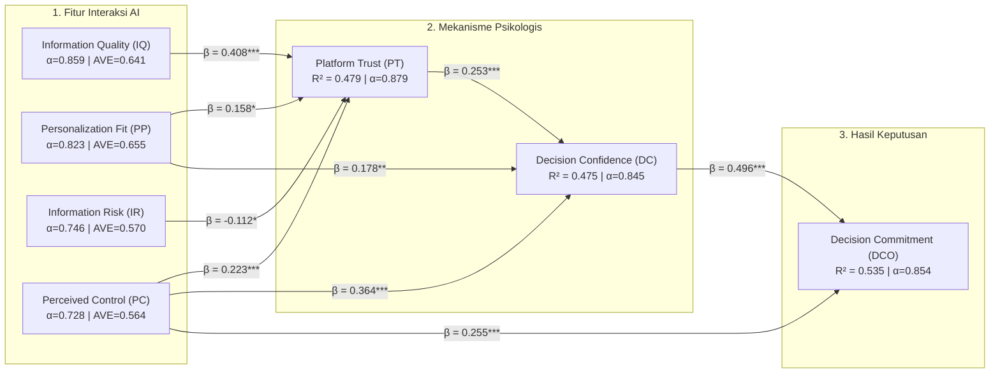
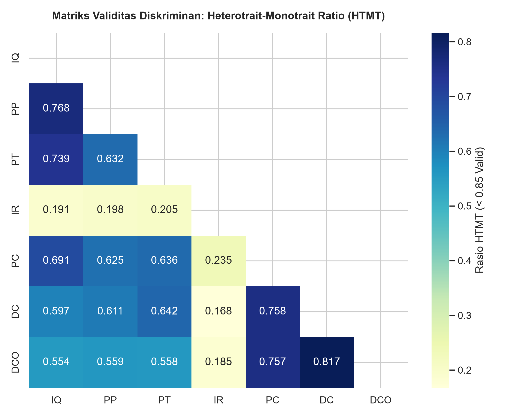

# ✈️ Tourism Decision Analytics: Human-GenAI & OTA Interaction

[](https://www.python.org/)
[]()
[]()
[](https://www.polban.ac.id/)

Repositori analitika data, eksperimen laboratorium, dan kode sumber pemodelan komputasional untuk penelitian:
> **"From Intention to Decision: Peran Generative AI (GenAI) dan Online Travel Agency (OTA) dalam Pengambilan Keputusan Perjalanan Wisata Internasional"**

---

## 📌 1. Ringkasan Penelitian (*Executive Summary*)

Penelitian ini mengkaji bagaimana wisatawan berinteraksi dengan platform *Generative AI* (ChatGPT, Gemini, Claude) dan *Online Travel Agency* (Trip.com, Agoda) dalam merencanakan perjalanan internasional mandiri (Studi Kasus: Rute 5D4N Shanghai–Hangzhou, Budget $\le$ CNY 8.000).

Melalui pendekatan multidisiplin yang memadukan **Sistem Informasi (SEM-PLS)** dan **Data Science / Algoritma (Association Rule Mining)**, penelitian ini mengungkap:
1. **Peran Kunci *Perceived Control*:** Rasa memegang kendali atas AI ($\beta = 0.364, p < 0.001$) merupakan prediktor terbesar keyakinan keputusan (*Decision Confidence*), mengalahkan Kualitas Informasi langsung.
2. **Perilaku Verifikasi Silang (*Cross-Verification*):** Sebanyak **93.1% pengguna melakukan verifikasi ulang** ke OTA/Search Engine. Aturan asosiasi ($\text{Conf} = 89.7\%, \text{Lift} = 1.838$) membuktikan bahwa **waktu tempuh (*transit time*)** dan **jam buka atraksi** adalah komponen yang paling kritis diverifikasi.
3. **Pola Sekuensial Dominan:** $47.6\%$ pengguna mengadopsi pola kerja *"GenAI terlebih dahulu (ideasi & itinerary) $\rightarrow$ kemudian OTA (validasi harga & ketersediaan)"*.

---

## 📊 2. Kerangka Model Konseptual & Struktural



---

## 🔬 3. Temuan Kunci Analisis Data

### A. Pengukuran Model (*Outer Model Evaluation*)
*Semua indikator memenuhi kriteria validitas konvergen, reliabilitas, dan validitas diskriminan:*
- **Cronbach's Alpha:** $0.728 - 0.925$ (semua $> 0.70$).
- **Composite Reliability (CR):** $0.837 - 0.947$ (semua $> 0.70$).
- **Average Variance Extracted (AVE):** $0.564 - 0.818$ (semua $> 0.50$).
- **HTMT Ratio:** Semua nilai $< 0.85$ (validitas diskriminan terpenuhi sempurna).

### B. Uji Mediasi (*Bootstrapping 5.000 Samples*)
- $\text{PT} \rightarrow \text{DC} \rightarrow \text{DCO}$: Indirect $\beta = +0.127$, $95\%\text{ CI } [+0.050, +0.214], p < 0.001$ (**Full Mediation Terbukti**).
- $\text{IQ} \rightarrow \text{PT} \rightarrow \text{DC}$: Indirect $\beta = +0.104$, $95\%\text{ CI } [+0.044, +0.174], p < 0.001$ (**Full Mediation Terbukti**).
- $\text{PC} \rightarrow \text{DC} \rightarrow \text{DCO}$: Indirect $\beta = +0.181$, $95\%\text{ CI } [+0.104, +0.268], p < 0.001$ (**Partial Mediation Terbukti**).

### C. Komparasi Algoritma Data Mining (*FP-Growth vs Apriori*)
- Pada $\text{Min Support} = 0.20$, kedua algoritma menemukan **45.515 frequent itemsets**.
- **FP-Growth (738 ms)** terbukti **$1.18\times - 1.23\times$ lebih cepat** dibandingkan Apriori (872 ms) berkat struktur *FP-Tree* yang mengeliminasi proses *candidate generation*.

---

## 🖼️ 4. Galeri Visualisasi Hasil (300 DPI)

| Visualisasi 1: Profil & Pola Penggunaan | Visualisasi 2: Evaluasi Outer Model |
|:---:|:---:|
|  |  |

| Visualisasi 3: Matriks Korelasi HTMT | Visualisasi 4: Benchmark FP-Growth vs Apriori |
|:---:|:---:|
|  |  |

| Visualisasi 5: Persebaran Aturan Asosiasi (Support vs Confidence vs Lift) |
|:---:|
|  |

---

## 📁 5. Struktur Berkas Repositori

```
├── All - From Intention to Decision - 319 Respondent.xlsx  # Dataset survei eksperimen mentah (N=318)
├── 1. Skenario Lab Experiment rev.docx                     # Dokumen panduan skenario lab
│
├── rencana_eksperimen.md                                  # Protokol & rencana detail eksperimen lab
├── draft_paper_association_rules.md                       # Draf naskah artikel ilmiah (Association Mining)
│
├── check_screening.py                                     # Skrip verifikasi screening responden
├── run_analysis.py                                        # Skrip analisis statistik SEM-PLS & Bootstrap
├── run_association_mining.py                              # Skrip algoritma FP-Growth vs Apriori
├── export_tables_and_plots.py                             # Skrip pembuat 8 tabel CSV & 5 grafik PNG
│
├── tabel_1_demografi_responden.csv                        # Tabel profil demografi (N=248)
├── tabel_2_outer_model_validitas_reliabilitas.csv         # Evaluasi Alpha, CR, AVE
├── tabel_3_discriminant_validity_fornell_larcker.csv      # Matriks Fornell-Larcker
├── tabel_4_discriminant_validity_htmt.csv                 # Matriks rasio HTMT
├── tabel_5_path_coefficients_regresi.csv                  # Hasil uji hipotesis regresi struktural
├── tabel_6_mediasi_bootstrap.csv                          # Uji pengaruh tidak langsung Bootstrap 5000
├── tabel_7_benchmark_fpgrowth_vs_apriori.csv              # Tabel benchmark waktu komputasi
├── tabel_8_top_association_rules.csv                      # Top aturan asosiasi berbobot tinggi
└── association_rules_tourism_genai.csv                    # Dataset lengkap hasil ekstraksi rules
```

---

## ⚡ 6. Panduan Instalasi & Eksekusi (*Reproduction Guide*)

### Prasyarat
- Python 3.10+
- Manajer paket `uv` (direkomendasikan) atau `pip`

### Instalasi Dependensi
```bash
# Menggunakan uv (otomatis mengunduh dependensi)
uv run python export_tables_and_plots.py

# Atau menggunakan pip standar
pip install pandas openpyxl numpy scipy statsmodels mlxtend matplotlib seaborn
```

### Menjalankan Skrip
```bash
# 1. Jalankan Analisis Statistik SEM & Mediasi
python run_analysis.py

# 2. Jalankan Association Rule Mining (FP-Growth vs Apriori)
python run_association_mining.py

# 3. Ekspor Ulang Semua Tabel CSV & Grafik Gambar
python export_tables_and_plots.py
```

---

## 🏛️ 7. Kontributor & Afiliasi
- **Jurusan Teknik Komputer dan Informatika (JTK)**
- **Politeknik Negeri Bandung (POLBAN)**, Bandung, Indonesia
