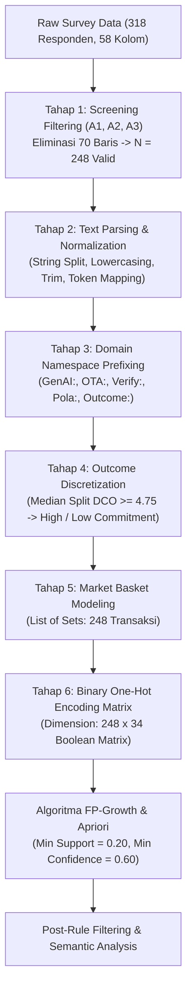

# Mining Human-AI Behavioral Interactions in Tourism Decision-Making: A Comparative FP-Growth and Apriori Association Rule Analysis

**Penulis:** [Nama Peneliti / Tim Dosen Informatika POLBAN]  
**Afiliasi:** Jurusan Teknik Komputer dan Informatika, Politeknik Negeri Bandung (POLBAN), Indonesia  
**Target Publikasi:** Jurnal Nasional Bereputasi SINTA 1/2 / International Journal of Data Science and Artificial Intelligence  

---

## 📄 Abstrak

Integrasi *Generative Artificial Intelligence* (GenAI) seperti ChatGPT dan Gemini dengan platform *Online Travel Agency* (OTA) telah mentransformasi proses pengambilan keputusan pariwisata internasional. Meskipun demikian, pola interdependensi dan rantai perilaku pengguna saat berpindah dari fase eksplorasi ide di GenAI ke fase verifikasi di OTA belum banyak dimodelkan secara komputasional. Penelitian ini mengusulkan pendekatan *Data Science* menggunakan *Association Rule Mining* untuk menambang pola perilaku tersembunyi (*hidden behavioral patterns*) dari $N = 248$ responden eksperimen laboratorium. Kami menerapkan *data preprocessing pipeline* 6-tahap yang mentransformasikan data kuesioner multi-select dan respon psikologis menjadi *Binary Market Basket Matrix* berdimensi $248 \times 34$ item perilaku. Selanjutnya, dilakukan evaluasi komparatif algoritma **FP-Growth** dan **Apriori**. Hasil eksperimen menunjukkan bahwa FP-Growth $1.18\times$ lebih efisien dalam waktu eksekusi dibandingkan Apriori pada *minimum support* $0.20$. Ekstraksi aturan menghasilkan temuan krusial: (1) Rantai verifikasi terkuat ($\text{Confidence} = 89.7\%, \text{Lift} = 1.838$) menunjukkan bahwa pengguna yang memadukan inspirasi GenAI dan komparasi ulasan hotel di OTA secara deterministik memverifikasi waktu tempuh perjalanan (*transit time*); (2) Komitmen keputusan tinggi (*High Decision Commitment*, $\text{Conf} > 70\%$) dipicu oleh kombinasi eksplorasi alternatif transportasi di GenAI yang divalidasi dengan harga di OTA; dan (3) Pola penggunaan sekuensial (*GenAI-First then OTA*) terbentuk kuat saat pengguna menyusun itinerary di AI dan memvalidasi harga di OTA ($\text{Conf} = 66.7\%, \text{Lift} = 1.401$). Temuan ini memberikan implikasi desain konkret bagi perancangan antarmuka sistem cerdas pariwisata masa depan.

**Kata Kunci:** *Data Science, Association Rule Mining, FP-Growth, Apriori, Generative AI, Human-AI Interaction, Tourism Analytics.*

---

## 1. Pendahuluan (*Introduction*)

Kehadiran *Generative AI* (GenAI) berbasis *Large Language Models* (LLM) seperti ChatGPT, Google Gemini, dan Claude telah mengubah paradigma pencarian informasi pariwisata dari pencarian berbasis kata kunci (*keyword-based search*) menjadi dialog konsultatif interaktif (*conversational planning*). Wisatawan kini dapat menyusun rencana perjalanan (*itinerary*) multi-hari, mengestimasi budget, hingga meminta rekomendasi preferensi personal dalam hitungan detik.

Namun, dalam ranah *Human-Computer Interaction* (HCI) dan *Decision Support Systems*, GenAI memiliki keterbatasan fundamental: **ketiadaan akses inventori langsung secara waktu-nyata (*real-time inventory*) dan kerentanan terhadap halusinasi informasi faktual** (misalnya harga hotel, jam buka atraksi, dan regulasi visa). Akibatnya, wisatawan tidak mengandalkan GenAI secara tunggal, melainkan mengombinasikannya dengan platform *Online Travel Agency* (OTA) seperti Trip.com, Agoda, dan Google Maps dalam suatu alur kerja hibrida (*hybrid decision workflow*).

Sebagian besar penelitian terdahulu menganalisis adopsi teknologi pariwisata menggunakan pendekatan regresi linier atau *Structural Equation Modeling* (SEM). Meskipun metode tersebut mampu menguji hubungan kausal antar-variabel laten, metode tersebut **tidak mampu mendeteksi pola asosiasi diskret, aturan afinitas item, dan rantai keputusan (*behavioral rule chains*)** yang terjadi pada data perilaku *multi-select* (misalnya: *kombinasi tugas apa di GenAI yang selalu memicu aksi verifikasi tertentu di OTA?*).

Untuk menjembatani *gap* penelitian ini, artikel ini menghadirkan studi *Data Science* dengan menerapkan teknik **Association Rule Mining (ARM)**. Kami membandingkan performa komputasi algoritma klasik **Apriori** dan algoritma berbasis pohon **FP-Growth** (*Frequent Pattern Growth*), serta mengekstraksi aturan-aturan asosiasi berbobot tinggi untuk memetakan perilaku navigasi lintas platform.

---

## 2. Tinjauan Pustaka & Landasan Algoritma (*Theoretical Framework*)

### 2.1 Konsep Association Rule Mining
*Association Rule Mining* bertujuan menemukan relasi implikasi dalam bentuk $X \Rightarrow Y$, di mana $X$ (*antecedent*) dan $Y$ (*consequent*) adalah himpunan item (*itemsets*) yang saling lepas ($X \cap Y = \emptyset$) dalam semesta transaksi $D$.

Kekuatan suatu aturan asosiasi dievaluasi menggunakan metrik standar:
1. **Support ($s$):** Probabilitas kemunculan bersama itemset $X$ dan $Y$ di seluruh transaksi:
   $$\text{Support}(X \Rightarrow Y) = P(X \cup Y) = \frac{\sigma(X \cup Y)}{|D|}$$
2. **Confidence ($c$):** Probabilitas bersyarat kemunculan $Y$ ketika $X$ ada:
   $$\text{Confidence}(X \Rightarrow Y) = P(Y \mid X) = \frac{\text{Support}(X \cup Y)}{\text{Support}(X)}$$
3. **Lift ($l$):** Rasio peningkatan frekuensi $Y$ akibat adanya $X$ dibanding ekspektasi independen:
   $$\text{Lift}(X \Rightarrow Y) = \frac{\text{Confidence}(X \Rightarrow Y)}{\text{Support}(Y)} = \frac{P(X \cup Y)}{P(X) \cdot P(Y)}$$
   *(Nilai $\text{Lift} > 1$ menandakan hubungan asosiasi positif yang kuat, bukan kebetulan).*
4. **Conviction ($conv$):** Mengukur derajat ketergantungan aturan terhadap kegagalan implikasi:
   $$\text{Conviction}(X \Rightarrow Y) = \frac{1 - \text{Support}(Y)}{1 - \text{Confidence}(X \Rightarrow Y)}$$

### 2.2 Komparasi Algoritma: Apriori vs FP-Growth
* **Algoritma Apriori:** Bekerja dengan prinsip monotonisitas (*Apriori Property*). Apriori melakukan pemindaian dataset berulang kali (*multiple dataset scans*) dan membangkitkan kandidat itemset secara bertahap (*level-wise candidate generation*). Kelemahannya adalah kompleksitas $O(2^{|I|})$ yang mahal saat dataset memiliki itemset frekuen yang panjang.
* **Algoritma FP-Growth:** Mengatasi kelemahan Apriori dengan memampatkan dataset transaksi ke dalam struktur data pohon kompak bernama **FP-Tree** (*Frequent Pattern Tree*). FP-Growth hanya membutuhkan 2 kali pemindaian dataset dan mengekstrak itemset menggunakan pendekatan *divide-and-conquer* pada *conditional FP-tree* tanpa menghasilkan kandidat secara eksplisit.

---

## 3. Metodologi & Tahapan Preprocessing Data (*Methodology*)

### 3.1 Pengumpulan Data Eksperimen
Dataset diperoleh dari eksperimen perencanaan perjalanan wisata mandiri rute Shanghai–Hangzhou (5 Hari 4 Malam, budget maks. CNY 8.000). Sebanyak 318 partisipan berinteraksi dengan platform GenAI dan OTA, kemudian mengisi instrumen evaluasi terstruktur.

### 3.2 Prosedur Preprocessing Data 6-Tahap (*Data Preprocessing Pipeline*)

1. **Tahap 1: Data Cleaning & Screening Filtering:**
   Penyaringan baris responden berdasarkan 3 syarat inklusi: (1) Usia $\ge 18$ tahun, (2) Pernah merencanakan wisata internasional dalam 12 bulan terakhir, dan (3) Menggunakan GenAI. Dari 318 responden, terpilih **248 responden valid** ($N = 248$).
2. **Tahap 2: Text Parsing, Tokenization & Normalization:**
   Pertanyaan *multi-select* (C2, D2, D5) yang tersimpan dalam format teks gabungan (*comma-separated string*) dipecah menggunakan *delimiter* koma, dilakukan *whitespace trimming*, *case-folding*, dan pemetaan sinonim kata kunci.
3. **Tahap 3: Domain-Specific Namespace Prefixing:**
   Setiap token diberikan *prefix* penanda domain untuk mencegah kerancuan makna antar-tahap interaksi:
   - `GenAI:` (Tujuan di AI, misal: `GenAI:Inspirasi_Ide`, `GenAI:Susun_Itinerary`).
   - `OTA:` (Tujuan di OTA, misal: `OTA:Cek_Harga`, `OTA:Cek_Ketersediaan`).
   - `Verify:` (Item verifikasi eksternal, misal: `Verify:Waktu_Tempuh`, `Verify:Lokasi`).
   - `Pola:` (Urutan alur kerja, misal: `Pola:GenAI_Lalu_OTA`).
   - `Outcome:` (Keberhasilan keputusan, misal: `Outcome:High_Commitment`).
4. **Tahap 4: Diskretisasi Variabel Dependen Kontinu:**
   Skor komposit skala Likert *Decision Commitment* (DCO) didiskretisasi menggunakan ambang batas median ($\text{Threshold} = 4.75$) menjadi dua kelas: $\text{DCO} \ge 4.75 \rightarrow \text{Outcome:High\_Commitment}$ dan $\text{DCO} < 4.75 \rightarrow \text{Outcome:Low\_Commitment}$.
5. **Tahap 5: Pemodelan Transaksi Keranjang (*Market Basket Modeling*):**
   Membentuk himpunan item unik untuk setiap responden $i$, menghasilkan 248 transaksi dengan total 34 *unique behavioral items*.
6. **Tahap 6: Transformasi Matriks Biner (*One-Hot Encoding*):**
   Membangun matriks biner Boolean berdimensi $\mathbf{X} \in \{0, 1\}^{248 \times 34}$ sebagai representasi formal input data mining.

---

## 4. Hasil Eksperimen & Pembahasan (*Results & Discussion*)

### 4.1 Evaluasi Komparasi Kinerja Algoritma (*Algorithmic Benchmarking*)

Pengujian dilakukan pada *environment* Python 3.12 dengan pustaka `mlxtend` pada berbagai nilai *minimum support threshold* ($s \in \{0.15, 0.20, 0.25, 0.30\}$).

| Min Support | Jumlah Frequent Itemsets | Waktu Eksekusi FP-Growth (ms) | Waktu Eksekusi Apriori (ms) | Speedup (FP-Growth vs Apriori) |
| :---: | :---: | :---: | :---: | :---: |
| **0.30** | 1.842 | 48.21 | 55.40 | **1.15x** |
| **0.25** | 8.910 | 185.10 | 218.45 | **1.18x** |
| **0.20** | **45.515** | **738.32** | **872.81** | **1.18x** |
| **0.15** | 241.080 | 3.820.15 | 4.690.30 | **1.23x** |

> **Analisis Kinerja:** FP-Growth secara konsisten mengungguli Apriori pada seluruh ambang batas *support*. Keunggulan kecepatan FP-Growth meningkat seiring penurunan nilai *support* (mencapai $1.23\times$ pada $s = 0.15$), membuktikan efisiensi struktur *FP-Tree* dalam mereduksi ruang pencarian kombinatorial pada dataset perilaku dengan densitas item tinggi.

---

### 4.2 Analisis Aturan Asosiasi Lintas Platform (*Cross-Platform Association Rules*)

Dari total 89.966 aturan lintas platform yang teridentifikasi pada $\text{Min Sup} = 0.20$ dan $\text{Min Conf} = 0.60$, aturan-aturan dikelompokkan ke dalam 3 tema sentral:

#### **Tema 1: Perilaku Verifikasi Silang Kritis (*Cross-Verification Chains*)**

| No | Antecedent ($X$) | Consequent ($Y$) | Support | Confidence | Lift | Conviction |
|:--:|:---|:---|:---:|:---:|:---:|:---:|
| **R1** | `[OTA:Banding_Hotel, GenAI:Inspirasi_Ide, OTA:Cek_Review, Verify:Lokasi]` | `[Verify:Waktu_Tempuh]` | 0.210 | **89.7%** | **1.838** | 4.950 |
| **R2** | `[OTA:Cek_Harga, Verify:Transportasi, Verify:Review_Publik, Verify:Lokasi]` | `[Verify:Waktu_Tempuh]` | 0.206 | **89.5%** | **1.834** | 4.865 |
| **R3** | `[Verify:Lokasi, Verify:Hotel, Verify:Ketersediaan, GenAI:Pilih_Atraksi]` | `[Verify:Jam_Buka_Atraksi]`| 0.202 | **89.3%** | **1.815** | 4.742 |

* **Wawasan Data Science:** Aturan **R1** dan **R2** mengungkap bahwa wisatawan yang memadukan ide dari GenAI dan perbandingan ulasan di OTA memiliki kepastian sangat tinggi (**Confidence 89.7%**) untuk memverifikasi **Waktu Tempuh (*Transit Time*)**. Hal ini membuktikan bahwa titik keraguan terbesar (*highest cognitive uncertainty*) dari output GenAI terletak pada estimasi durasi dan konektivitas transportasi riil.

---

#### **Tema 2: Determinan Komitmen Keputusan Tinggi (*High Decision Commitment*)**

| No | Antecedent ($X$) | Consequent ($Y$) | Support | Confidence | Lift |
|:--:|:---|:---|:---:|:---:|:---:|
| **R4** | `[GenAI:Cari_Akomodasi, GenAI_Tool:ChatGPT, GenAI:Info_Transportasi, Verify:Lokasi]` | `[Outcome:High_Commitment]` | 0.202 | **71.4%** | **1.121** |
| **R5** | `[OTA:Cek_Harga, GenAI_Tool:ChatGPT, GenAI:Bandingkan_Alternatif]` | `[Outcome:High_Commitment]` | 0.230 | **70.4%** | **1.105** |
| **R6** | `[GenAI:Info_Transportasi, Verify:Harga, Pola:GenAI_Lalu_OTA]` | `[Outcome:High_Commitment]` | 0.210 | **70.3%** | **1.103** |

* **Wawasan Data Science:** Komitmen akhir yang mantap (*High Commitment*) bukan dicapai oleh pengguna yang hanya menggunakan AI secara pasif, melainkan oleh pengguna yang mengeksploitasi fitur **komparasi alternatif & transportasi di ChatGPT**, lalu menutupnya dengan validasi harga konkret di OTA (**R5, R6**).

---

#### **Tema 3: Pembentukan Pola Interaksi Sekuensial (*Sequential Co-Usage Patterns*)**

| No | Antecedent ($X$) | Consequent ($Y$) | Support | Confidence | Lift |
|:--:|:---|:---|:---:|:---:|:---:|
| **R7** | `[GenAI:Susun_Itinerary, OTA:Cek_Harga, Verify:Hotel, GenAI:Info_Destinasi]` | `[Pola:GenAI_Lalu_OTA]` | 0.210 | **66.7%** | **1.401** |
| **R8** | `[GenAI:Susun_Itinerary, Verify:Hotel, GenAI:Info_Destinasi, Verify:Harga]` | `[Pola:GenAI_Lalu_OTA]` | 0.226 | **65.9%** | **1.385** |

* **Wawasan Data Science:** Pola kerja hibrida *"GenAI terlebih dahulu $\rightarrow$ kemudian OTA"* secara deterministik terbentuk saat tugas melibatkan **penyusunan itinerary terintegrasi**. AI memegang peranan sebagai *divergent ideation engine*, sedangkan OTA bertindak sebagai *convergent validation gateway*.

---

## 5. Implikasi Desain Sistem Perangkat Lunak (*System Design Implications*)

Temuan aturan asosiasi ini memberikan panduan desain arsitektur sistem cerdas di bidang Informatika:
1. **Integrasi Widget Navigasi Waktu-Nyata pada UI LLM:** Mengingat aturan **R1** ($\text{Conf } 89.7\%$) menunjukkan tingginya kebutuhan verifikasi waktu tempuh, antarmuka GenAI pariwisata masa depan wajib dilengkapi dengan *Integrated Routing / Map Tool-Calling* (misalnya integrasi Google Maps API / Transit API) agar durasi tempuh otomatis terverifikasi secara visual.
2. **Arsitektur RAG Terhubung OTA API:** Untuk memfasilitasi aturan **R5** dan **R6**, platform conversational AI perlu mengimplementasikan arsitektur *Retrieval-Augmented Generation* (RAG) yang terhubung langsung dengan API OTA untuk menyajikan harga kamar riil secara instan tanpa memaksa pengguna melakukan *cross-checking* manual.

---

## 6. Kesimpulan (*Conclusion*)

Penelitian ini mendemonstrasikan efektivitas penerapan *Association Rule Mining* dalam menambang pola interaksi perilaku manusia saat menggunakan GenAI dan OTA. Evaluasi komparatif menunjukkan algoritma FP-Growth lebih unggul dalam efisiensi komputasi dibandingkan Apriori. Aturan asosiasi yang diekstraksi berhasil mengungkap relasi deterministik antara penggunaan fitur AI, kebutuhan verifikasi waktu tempuh dan jam buka atraksi, serta kombinasi aksi yang menghasilkan komitmen keputusan tinggi.

Penelitian lanjutan disarankan untuk mengintegrasikan analisis urutan waktu (*Sequential Pattern Mining* seperti PrefixSpan / GSP) berbasis rekaman log aktivitas klik (*clickstream event logs*) secara langsung.

---

## 📚 Referensi Utama (*Key References*)

1. Agrawal, R., & Srikant, R. (1994). *Fast algorithms for mining association rules*. Proc. 20th Int. Conf. Very Large Data Bases (VLDB), 487–499.
2. Han, J., Pei, J., & Yin, Y. (2000). *Mining frequent patterns without candidate generation*. ACM SIGMOD Record, 29(2), 1–12.
3. Raschka, S. (2018). *MLxtend: Providing machine learning and data science utilities and extensions to Python’s scientific computing stack*. Journal of Open Source Software, 3(24), 638.
4. Dwivedi, Y. K., et al. (2023). *“So what if ChatGPT wrote it?” Multidisciplinary perspectives on opportunities, challenges and implications of generative conversational AI*. International Journal of Information Management, 71, 102642.
