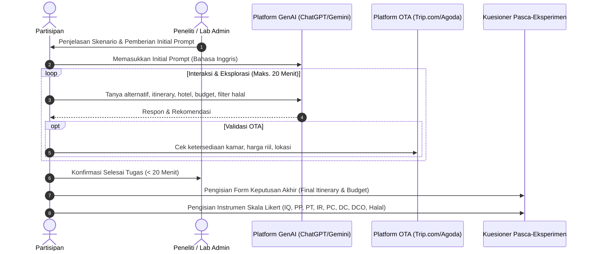
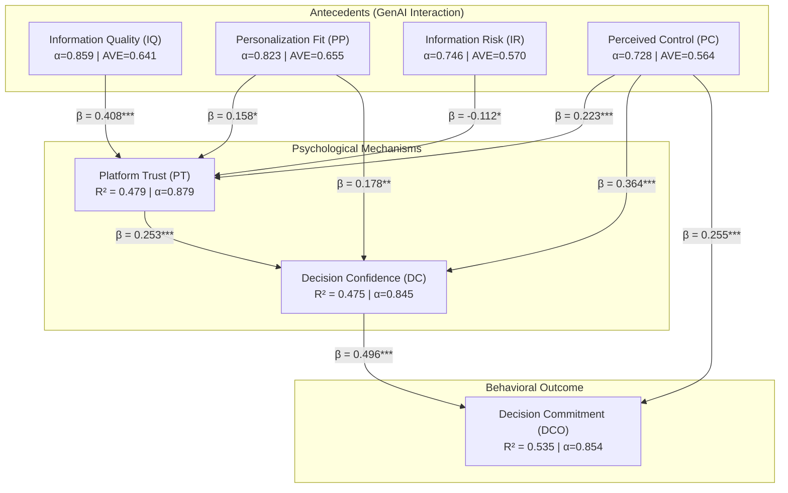

# 📋 Rencana & Protokol Lab Experiment
**Penelitian:** *From Intention to Decision: Peran Generative AI (GenAI) dan Online Travel Agency (OTA) dalam Pengambilan Keputusan Perjalanan Wisata Internasional*

---

## 📌 1. Ringkasan & Tujuan Eksperimen

### 1.1 Latar Belakang
Penggunaan *Generative AI* (seperti ChatGPT, Gemini, Claude) dalam industri pariwisata telah mengubah cara wisatawan mencari inspirasi, mengevaluasi pilihan, hingga menyusun rencana perjalanan. Namun, bagaimana interaksi dengan GenAI mempengaruhi kepercayaan (*Platform Trust*), rasa kendali (*Perceived Control*), keyakinan keputusan (*Decision Confidence*), hingga komitmen akhir (*Decision Commitment*)—terutama ketika digabungkan dengan platform OTA (*Online Travel Agency*) dan pertimbangan khusus (seperti kebutuhan Halal/Syariah)—memerlukan pembuktian empiris melalui eksperimen laboratorium terkontrol.

### 1.2 Tujuan Eksperimen
1. Mengamati perilaku dan pola interaksi natural wisatawan saat merencanakan perjalanan internasional menggunakan GenAI dan OTA.
2. Mengukur pengaruh kualitas informasi (*Information Quality*) dan kesesuaian personalisasi (*Personalization Fit*) terhadap kepercayaan pada platform (*Platform Trust*).
3. Menganalisis bagaimana kepercayaan (*Platform Trust*) dan kendali psikologis (*Perceived Control*) mendorong keyakinan (*Decision Confidence*) dan komitmen keputusan (*Decision Commitment*).
4. Meneliti peran pertimbangan khusus (seperti literasi dan kebutuhan Halal/Syariah) dalam memoderasi proses pengambilan keputusan.

---

## 👥 2. Kriteria Partisipan & Screening

| No | Kriteria Screening | Pertanyaan / Batasan | Syarat Kelolosan |
|:---:|:---|:---|:---:|
| 1 | **Usia** | A1. Apakah saat ini Anda berusia 18 tahun atau lebih? | **Ya** ($\ge 18$ tahun) |
| 2 | **Pengalaman/Intensi Wisata** | A2. Dalam 12 bulan terakhir, apakah Anda pernah merencanakan perjalanan internasional yang benar-benar Anda pertimbangkan untuk dilakukan? | **Ya** |
| 3 | **Adopsi Teknologi** | A3. Apakah Anda menggunakan Generative AI (GenAI) saat merencanakan perjalanan tersebut? *(ChatGPT, Gemini, Claude, Copilot, Perplexity, dll.)* | **Ya / Yes** |
| 4 | **Kemampuan Bahasa** | Penguasaan Bahasa Inggris dasar/menengah untuk berinteraksi dengan platform GenAI *(All participants use English during the GenAI task)*. | **Memenuhi** |

---

## 🗺️ 3. Skenario Tugas Eksperimen (*Task Scenario*)

### 3.1 Profil Perjalanan
- **Destinasi:** Shanghai dan Hangzhou, China.
- **Tujuan Perjalanan:** Wisata Pribadi (*Leisure / Holiday*).
- **Jumlah Wisatawan:** 1 orang dewasa (*solo traveler*).
- **Waktu Perjalanan:** 15 – 19 Maret 2027 (5 Hari 4 Malam).
- **Titik Kedatangan & Keberangkatan:** Shanghai (In & Out).

### 3.2 Alokasi Anggaran (*Budget*)
- **Total Budget Lokal:** Sekitar **CNY 6.000 – CNY 8.000** (atau setara dengan **Rp 15.800.000 – Rp 18.000.000**).
- **Komponen yang Dicakup dalam Budget:**
  - Akomodasi/Hotel (4 malam);
  - Transportasi antarkota (kereta cepat Shanghai $\leftrightarrow$ Hangzhou);
  - Transportasi lokal (metro, taksi/Didi, bus);
  - Makanan & minuman harian;
  - Tiket masuk atraksi/aktivitas wisata.
- **Komponen yang Dikecualikan (*Excluded*):**
  - Tiket pesawat internasional (asal $\leftrightarrow$ Shanghai);
  - Biaya visa & asuransi perjalanan;
  - Pengeluaran pribadi / oleh-oleh.

### 3.3 Preferensi Akomodasi
- Hotel kelas bintang 3 – 4;
- Kamar pribadi dengan kamar mandi dalam (*private bathroom*);
- Lokasi strategis dan dekat dengan akses transportasi umum (stasiun metro);
- Memiliki *rating* ulasan pengguna yang baik.

### 3.4 Pertimbangan Tambahan
- **Kebutuhan Halal/Syariah (opsional/relevan bagi responden Muslim):** Ketersediaan makanan halal, restoran ramah muslim, fasilitas ibadah, atau opsi pembayaran yang sesuai.

---

## ⚙️ 4. Prosedur & Protokol Pelaksanaan

### 4.1 Batasan Waktu & Aturan Navigasi
- **Durasi Maksimal:** **20 Menit**. Partisipan dapat berhenti lebih cepat jika keputusan sudah dirasa mantap.
- **Platform yang Diizinkan:** Hanya platform GenAI yang disediakan dan/atau OTA yang ditentukan.
- **Platform yang Dilarang:** Partisipan tidak diperkenankan membuka mesin pencari umum (Google Search mandiri), media sosial, blog eksternal, atau forum di luar platform uji. Catatan verifikasi dituangkan di lembar refleksi.

### 4.2 Initial Prompt Standar (GenAI)
Partisipan wajib memulai interaksi dengan prompt standar berikut:
> *"I am planning a five-day, four-night leisure trip to Shanghai and Hangzhou, China, from 15–19 March 2027. I will arrive in and depart from Shanghai. I am travelling alone. My total budget for expenses within China is approximately CNY 6,000–8,000. This budget includes accommodation, transportation within China, food, attractions, and activities. International airfare, visa, travel insurance, and personal shopping are excluded. I prefer a 3–4 star hotel with a private room and bathroom, good user ratings, a relatively strategic location, and convenient access to public transportation. I am free to decide how many days to spend in Shanghai and Hangzhou, where to stay, which attractions and activities to visit, what transportation to use, and how to arrange my itinerary. Please help me explore suitable alternatives for this trip before I make my final travel decision."*

Setelah prompt awal, partisipan bebas melanjutkan percakapan (meminta rekomendasi makanan halal, rute harian, hotel alternatif, dll.).

---

## 📝 5. Output Keputusan Akhir Responden (*Final Decision Sheet*)

Setelah selesai menggunakan platform, responden mengisi formulir keputusan:
1. **Alokasi Waktu:** Hari di Shanghai (.... hari) dan Hangzhou (.... hari).
2. **Pilihan Akomodasi:** Nama hotel & area lokasi di Shanghai dan Hangzhou.
3. **Daftar Atraksi Utama:** Tempat wisata yang dipilih per hari (Day 1 s.d. Day 5).
4. **Moda Transportasi:** Antarkota (misal: *High-Speed Train*) dan dalam kota (Metro/Bus).
5. **Estimasi Rincian Biaya:** Akomodasi, Transportasi, Makan, Tiket Atraksi, Total (CNY / IDR).
6. **Alasan Utama Keputusan:** Deskripsi kualitatif pertimbangan pemilihan.
7. **Pertimbangan Halal/Syariah:** Penjelasan apakah aspek halal memengaruhi keputusan akomodasi/makanan.
8. **Waktu Penyelesaian:** Menit dan detik yang dihabiskan.

---

## 📊 6. Instrumen Pengukuran Konstruk (Skala Likert 1–6)

*Skala pengukuran menggunakan 6 poin: (1) Sangat Tidak Setuju s.d. (6) Sangat Setuju.*

### 6.1 Information Quality (IQ)
- **IQ1:** Informasi yang diberikan GenAI relevan dengan kebutuhan perjalanan saya.
- **IQ2:** Informasi yang diberikan GenAI cukup lengkap untuk membantu saya mengevaluasi pilihan perjalanan.
- **IQ3:** Informasi yang diberikan GenAI jelas dan mudah dipahami.
- **IQ4:** Informasi yang diberikan GenAI cukup akurat untuk membantu saya membuat keputusan perjalanan.
- **IQ5:** Informasi yang diberikan GenAI cukup terkini untuk kebutuhan perencanaan perjalanan saya.

### 6.2 Personalization & Preference Fit (PP)
- **PP1:** Rekomendasi GenAI sesuai dengan kebutuhan perjalanan saya.
- **PP2:** GenAI memberikan pilihan yang sesuai dengan preferensi perjalanan saya.
- **PP3:** GenAI membantu saya menyesuaikan pilihan perjalanan dengan budget saya.
- **PP4:** GenAI membantu saya menyesuaikan rencana dengan waktu dan kondisi perjalanan saya.

### 6.3 Platform Trust in GenAI (PT)
- **PT1:** Saya percaya informasi yang diberikan GenAI dapat diandalkan.
- **PT2:** Saya percaya GenAI dapat membantu saya membuat keputusan perjalanan yang tepat.
- **PT3:** Saya merasa cukup aman menggunakan informasi dari GenAI sebagai dasar pertimbangan perjalanan.
- **PT4:** Secara keseluruhan, saya mempercayai GenAI sebagai pendukung dalam membuat keputusan perjalanan.

### 6.4 Information Risk & Skepticism (IR)
- **IR1:** Saya masih ragu untuk terlalu mengandalkan GenAI dalam membuat keputusan perjalanan yang penting.
- **IR2:** Saya merasa perlu berhati-hati sebelum mengikuti rekomendasi perjalanan dari GenAI.
- **IR3:** Saya kurang nyaman jika harus menggunakan GenAI sebagai satu-satunya dasar keputusan perjalanan.
- **IR4:** Saya enggan mengambil keputusan perjalanan penting berdasarkan rekomendasi GenAI tanpa memeriksanya melalui sumber lain.

### 6.5 Perceived Control (PC)
- **PC1:** GenAI membuat saya merasa memiliki kontrol atas proses perencanaan perjalanan.
- **PC2:** GenAI membantu saya membandingkan berbagai alternatif sebelum menentukan pilihan.
- **PC3:** Saya dapat dengan mudah meminta GenAI mengubah atau menyesuaikan rekomendasi sesuai kebutuhan saya.
- **PC4:** Ketika menggunakan GenAI, keputusan akhir tetap terasa sebagai keputusan saya sendiri.

### 6.6 Decision Confidence (DC)
- **DC1:** Setelah menggunakan GenAI, saya yakin bahwa pilihan perjalanan saya sudah tepat.
- **DC2:** Saya merasa yakin terhadap keputusan perjalanan yang saya buat.
- **DC3:** Saya yakin pilihan perjalanan tersebut sesuai dengan kebutuhan dan preferensi saya.
- **DC4:** Saya yakin rencana perjalanan yang saya pilih realistis untuk dilakukan.

### 6.7 Decision Commitment (DCO)
- **DCO1:** Saya bersedia mempertahankan sebagian besar keputusan perjalanan yang telah saya buat.
- **DCO2:** Saya siap menggunakan rencana perjalanan yang telah saya pilih.
- **DCO3:** Saya siap melanjutkan keputusan tersebut ke tahap berikutnya (booking/reservasi).
- **DCO4:** Saya tidak merasa perlu melakukan perubahan besar terhadap keputusan perjalanan yang telah dibuat.

### 6.8 Dimensi Khusus: Halal/Syariah (SHR, SHL, SCT)
- **SHR1 (Requirement):** Seberapa penting pertimbangan halal/Syariah bagi Anda ketika merencanakan perjalanan internasional ini? *(Skala 1: Sangat Tidak Penting – 6: Sangat Penting)*.
- **SHL1–SHL4 (Literacy):** Pemahaman prinsip halal, identifikasi layanan ramah muslim, evaluasi kredibilitas info halal, dan verifikasi info halal.
- **SCT1–SCT4 (Congruence Trust):** Kepercayaan bahwa GenAI mampu menyajikan informasi halal (makanan, akomodasi, nilai syariah) secara andal.

---

## 🔬 7. Rencana Analisis Data & Model Struktural

### 7.1 Tahapan Uji Statistik
1. **Pembersihan & Screening Data:** Memisahkan partisipan yang tidak memenuhi kriteria $A1, A2, A3$.
2. **Evaluasi Outer Model (Pengukuran):**
   - Validitas Konvergen: *Factor Loadings* ($> 0.60$) dan AVE ($> 0.50$).
   - Reliabilitas: Cronbach's Alpha ($> 0.70$) dan *Composite Reliability* ($> 0.70$).
   - Validitas Diskriminan: Kriteria *Fornell-Larcker* dan rasio HTMT ($< 0.85$).
3. **Evaluasi Inner Model (Struktural & Hipotesis):**
   - Koefisien Jalur ($\beta$), $t$-statistik, dan $p$-value.
   - Kekuatan Prediksi ($R^2$, $f^2$).
   - Uji Mediasi dengan *Bootstrapping 5.000 sampel* (95% CI bias-corrected).
4. **Analisis Moderasi & Subgrup:** Pengaruh tingkat kepentingan halal (`SHR1`) terhadap kepercayaan spesifik halal (`SCT`) dan keyakinan keputusan akhir.
